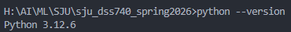
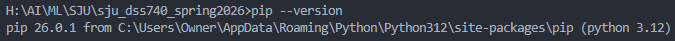
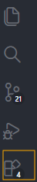
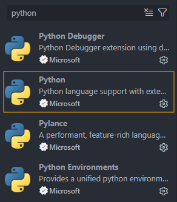
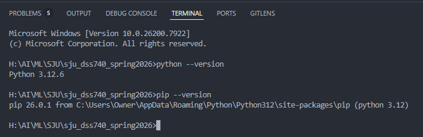

# DSS 740: Analytics with Machine Learning

## Spring 2026: Install Python

### 🐍: Install Python (Windows, macOS, and Linux)

1️⃣Windows Installation

Step 1 - Download Python

1. Go to: [https://www.python.org/downloads/](https://www.python.org/downloads/)
2. Click Download Python 3.1x.x
3. Run the installer

⚠️Important (Do NOT skip)

On the first installation screen:

- [X] Check: Add Python to PATH
  Then click **Install Now**

Step 2 - Verify Installation

```python
python --version
```

If you see something like this ⬇️, you are fine. If not, follow the instructions provided in ==05_python_installation_instructions.md==.



Check if pip is installed

```python
pip --version
```

or

```python
python -m pip --version
```

You should see something like this ⬇️. pip is a python package manager. It gets installed automatically with Python.



2️⃣ macOS Installation

Step 1 - Install Homebrew (if not already installed)

```python
/bin/bash -c "$(curl -fsSL https://raw.githubusercontent.com/Homebrew/install/HEAD/install.sh)"
```

Step 2 - Install Python

```python
brew install python@3.11
```

Step 3 - Verify Installation

```python
python3 --version
pip3 --version
```

3️⃣Linux (Ubuntu)

Most Linux systems already include Python, but we want to install 3.1x.x + version

Step 1 - Update system and Install Python

```python
sudo apt update
sudo apt install python3.11 python3.11-venv python3-pip -y
```

Step 2 -Verify Installation

```python
python3 --version
pip3 --version
```

---

### Install VS Code

Step 1 - Download from [code.visualstudio.com](https://code.visualstudio.com/)

Step 2 - After installation, open VS Code and click on **Extensions icon**



Type Python in the search bar and then Install **Python Extension** by Microsoft



Step 3 - Restart VS Code

Step 4 - Verify Installation

Open VSCode Terminal


Select Command Prompt from the drop down.


Type the following commands in the terminal to verify installation is complete.


