# DSS 740: Analytics with Machine Learning

## Spring 2026: GitHub Instructions

### Repository Instructions

This repository is the official distribution source for course materials. You will:

1. Clone it once
2. Pull updates weekly
3. Work only on your own branch
4. Submit assignments via Canvas

When working on course project, you will:

1. Create one repository per team and clone it
2. Create branch for each team member
3. Work on your respective branches and push changes to GitHub
4. Pull updates frequently to ensure everyone is working on the most updated codebase

#### 1. Clone the Repository

Open Visual Studio

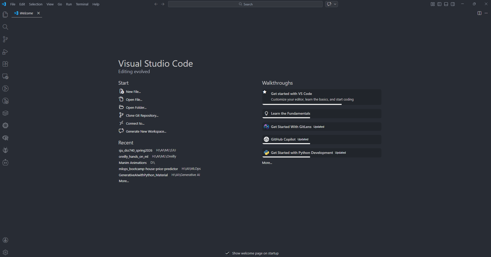

Click on Clone Git Repository

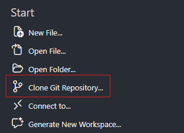

Paste the [Git Repository URL](https://github.com/sidchakravarty/sju_dss740_spring2026.git) for this course.

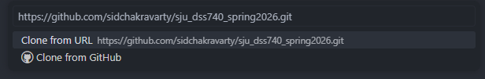

Navigate to a **local** folder on your computer. This is where you will set up your project.

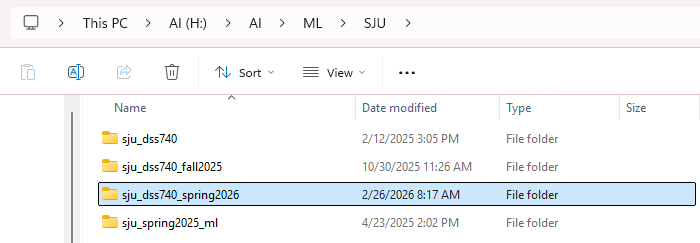

Click Open

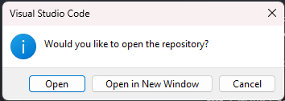

Indicate that the contents of this folder are trustworthy.

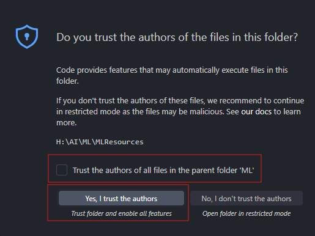

After this, the project files and folders will appear in the Project Explorer.

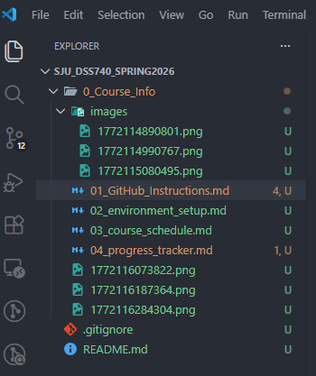

---

#### 2. Setup local branch and push updates to GitHub

##### Step 1 - Open VSCode Terminal

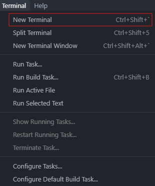

Select Command Prompt from the drop down.

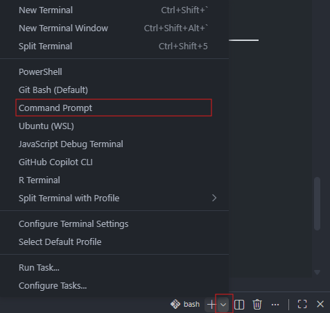

##### Step 2 - Check Git Status

Let's see the status of git and the branch we are on. We can see that we are in the branch and a lot of files are currently untracked.

```python
git init
git status
```

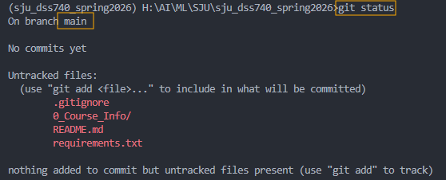

We can see ⬇️ the active branch in a couple of other places in VSCode, starting with the status bar.

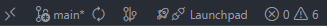

##### Step 3 - Create a new local branch

In the code below, the flag **'-b'** creates a new branch.

```python
git checkout -b feature/data_preprocessing
```

We can see ⬇️ that the branch has changed.

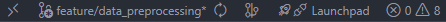

It is recommended to create separate branches so your work is isolated.

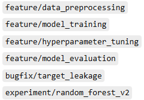

##### Step 4 - Make changes in the branch and commit

```python
git add .
git commit -m "<Enter a Comment to describe your work.>"
```

After commit the changes, the git flag will change from 'U' to 'A' or 'M'.

A - Added for new files.

M - Modified for existing files.

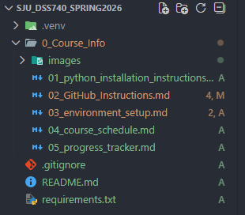

##### Step 5 - Push changes to GitHub

If pushing the changes to GitHub for the first time use the following code. In this code, we are setting the upstream (GitHub) branch for our local repository.

```python
git push -u origin feature/data_preprocessing
```

or use the following command. HEAD means "current branch".

```python
git push -u origin HEAD
```

For subsequent pushes, we only need to let Git know to push the code.

```python
git push
```

---

#### 3. Get updates from GitHub

##### Step 1 - Git Pull

To pull latest updates from GitHub, after switching to the main branch.

```python
git checkout main
git pull
```

##### Step 2 - Git Merge

This step is used to bring the local branch at the same stage as the main branch

```python
git merge feature/data_preprocessing
```
