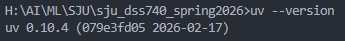
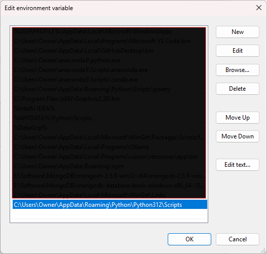
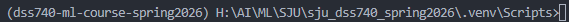

# DSS 740: Analytics with Machine Learning

## Spring 2026: Environment Setup

### Verify Python Setup

Step 1 - Open VSCode Terminal


Select Command Prompt from the drop down.


Step 2 - Check if Python is installed

```python
python --version
```

If you see something like this ⬇️, you are fine. If not, follow the instructions provided in ==01_python_installation_instructions.md==.


Step 3 - Check if pip is installed

```python
pip --version
```

or

```python
python -m pip --version
```

You should see something like this ⬇️. pip is a python package manager. It gets installed automatically with Python.


---

### Environment Setup

Install uv

We will use uv to setup our environment. uv is an extremely fast, all-in-one Python package and project manager written in Rust, designed to be a replacement for existing tools like pip. It offers significant speed advantages and streamlines the Python development workflow by integrating environment management, dependency resolution, and package installation into a single, cohesive command-line interface. is a python package manager. It gets installed automatically with Python.

```python
pip install uv
```

or

```python
python -m pip install uv
```

You should see something like this ⬇️.



If uv is not accessible, then the scripts folder needs to be added to PATH. Replace [Owner] with your user_name.




1️⃣Windows (Command Prompt)

If you see (base) in your terminal, run

```python
conda deactivate
```

Step 1 - Navigate to the course repository

```python
cd <path-to-your-cloned-repo>
```

Step 2 - Create virtual environment

```python
uv venv --python 3.11 --seed
```

Step 3 - Install required packages

```python
.\.venv\Scripts\python.exe -m pip install -r requirements.txt
.\.venv\Scripts\python.exe -m pip install mlflow
```

Step 4 - Activate the environment

```python
cd .venv
cd Scripts
activate
```

You should see the ⬇️ environment mentioned in the terminal.



Step 5 - Verify setup

```python
python -c "import sklearn; import mlflow; print('Environment OK')"
```

2️⃣macOS / Linux

Step 1 - Navigate to the course repository

```python
cd <path-to-your-cloned-repo>
```

Step 2 - Create virtual environment

```python
uv venv --python 3.11 --seed
```

Step 3 - Install required packages

```python
./.venv/bin/python -m pip install -r requirements.txt
./.venv/bin/python -m pip install mlflow
```

Step 4 - Activate the environment

```python
source .venv/bin/activate
```

Step 5 - Verify setup

Let's execute the following Python code in the terminal to check if the installation is working.

```python
python -c "import sklearn; import mlflow; print('Environment OK')"
```
